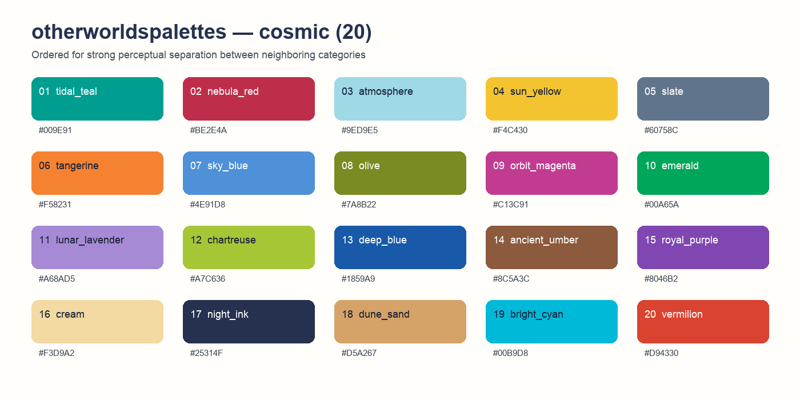

# otherworldspalettes

`otherworldspalettes` provides vivid qualitative colour palettes derived from
the *Other Worlds* art project. Colours are deliberately ordered so neighbouring
series jump across hue and lightness instead of forming clusters of similar
shades.



## Installation

```r
# install.packages("pak")
pak::pak("aolow/otherworldspalettes")
```

## Use

```r
library(ggplot2)
library(otherworldspalettes)

otherworlds_palettes()
otherworlds_palette(8, "nebula")

# Optional ggplot2 scales
ggplot(iris, aes(Sepal.Length, Sepal.Width, colour = Species)) +
  geom_point(size = 2) +
  scale_colour_otherworlds("Species", palette = "nebula")
```

The palettes are intended for qualitative data. For accessibility, do not rely
on colour alone when many groups are present: add direct labels, shapes, line
types, or facets. The 8-colour `nebula` palette is the preferred default for
figures that must remain easy to distinguish in print.
