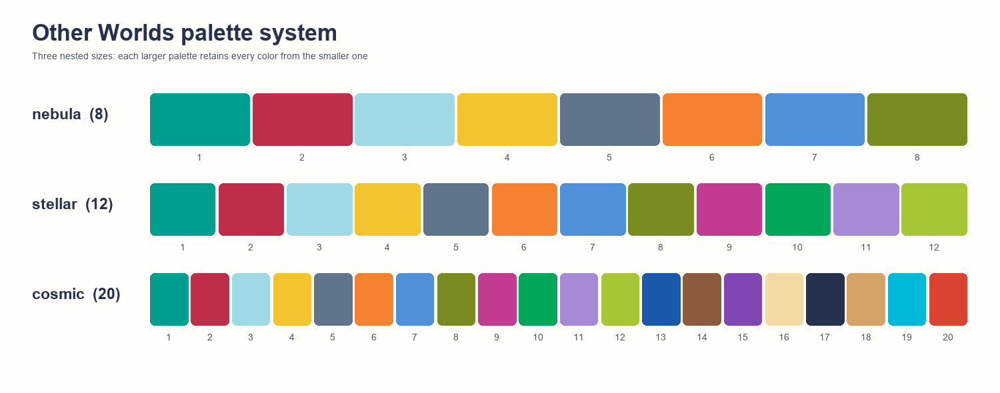
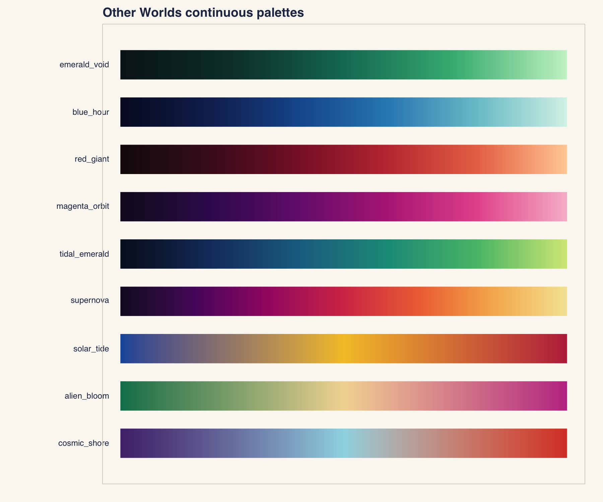
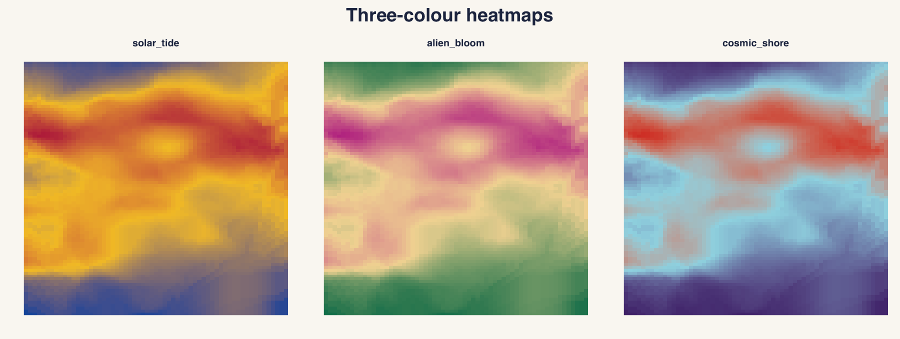

# otherworldspalettes

`otherworldspalettes` provides qualitative and continuous colour palettes
derived from the *Other Worlds* art project. Discrete colours are deliberately
ordered so neighbouring series jump across hue and lightness; continuous maps
move smoothly through deep-space shadows into luminous atmospheric colour.

## Palettes



The package contains three **nested sizes of one palette system**, rather than
three unrelated colour schemes:

- `nebula` contains 8 colours and is the recommended default for most figures.
- `stellar` contains the same 8 colours plus 4 additional colours, for 12 total.
- `cosmic` contains all `stellar` colours plus 8 additional colours, for 20 total.

This means a figure can grow from `nebula` to `stellar` or `cosmic` without
changing the colours already assigned to its existing groups. Within each
palette, the order jumps across hue and lightness to keep neighbouring groups
visually distinct.

## Installation

```r
# install.packages("pak")
pak::pak("aolow/otherworldspalettes")
```

## Use

```r
library(ggplot2)
library(otherworldspalettes)

otherworlds_palettes()

nebula <- otherworlds_palette(8, "nebula")
stellar <- otherworlds_palette(12, "stellar")
cosmic <- otherworlds_palette(20, "cosmic")

# Optional ggplot2 scales
ggplot(iris, aes(Sepal.Length, Sepal.Width, colour = Species)) +
  geom_point(size = 2) +
  scale_colour_otherworlds("Species", palette = "nebula")
```

The palettes are intended for qualitative data. For accessibility, do not rely
on colour alone when many groups are present: add direct labels, shapes, line
types, or facets. The 8-colour `nebula` palette is the preferred default for
figures that must remain easy to distinguish in print.

## Continuous palettes



The package also includes six continuous, dark-to-light palettes. The first
four explore a focused hue family; the final two move across hues in the spirit
of perceptually smooth scientific colour maps.

- `emerald_void` — mineral greens and luminous emerald.
- `blue_hour` — midnight indigo through atmospheric cyan.
- `red_giant` — oxblood, nebula red, and warm stellar light.
- `magenta_orbit` — deep violet through ion pink.
- `tidal_emerald` — blue-black through tidal blue and emerald to alien light.
- `supernova` — plum and magenta through red, solar gold, and a pale star core.

Three additional palettes are designed for heatmaps and centered data. Each
passes through a bright middle colour drawn from the paintings rather than a
generic white midpoint.



- `solar_tide` — deep blue through sun yellow to nebula red.
- `alien_bloom` — emerald through warm cream to orbit magenta.
- `cosmic_shore` — royal purple through atmospheric cyan to vermilion.

```r
otherworlds_continuous_palettes()
cols <- otherworlds_continuous_palette(100, "tidal_emerald")

ggplot(faithfuld, aes(waiting, eruptions, fill = density)) +
  geom_raster() +
  scale_fill_otherworlds_c(palette = "supernova")

# Three-colour heatmap
heatmap(volcano, col = otherworlds_continuous_palette(101, "solar_tide"))
```
